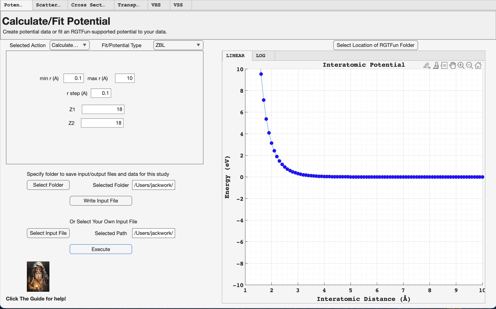
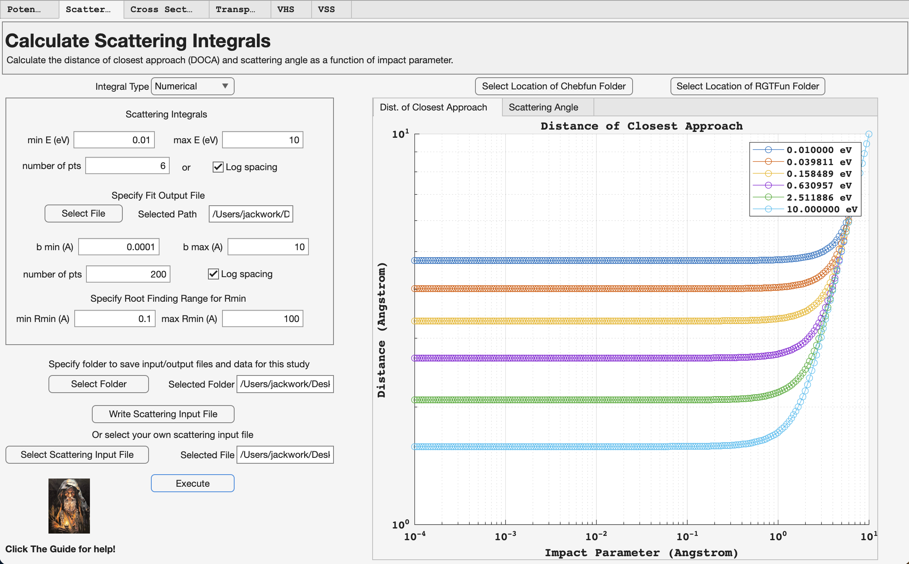
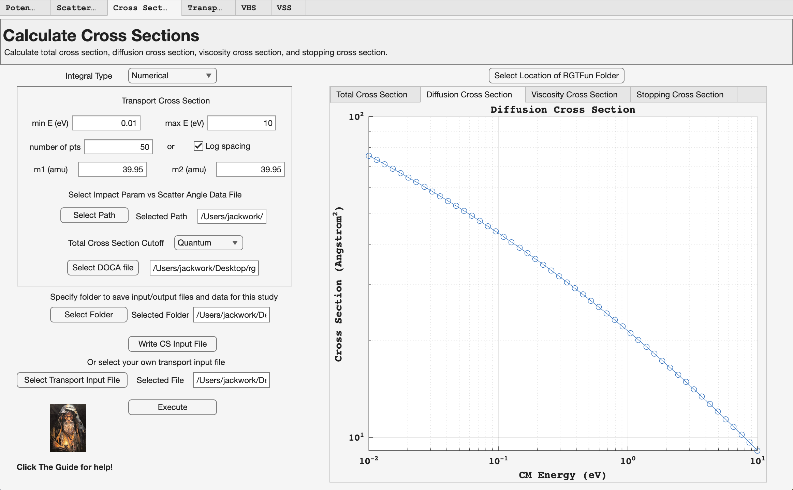
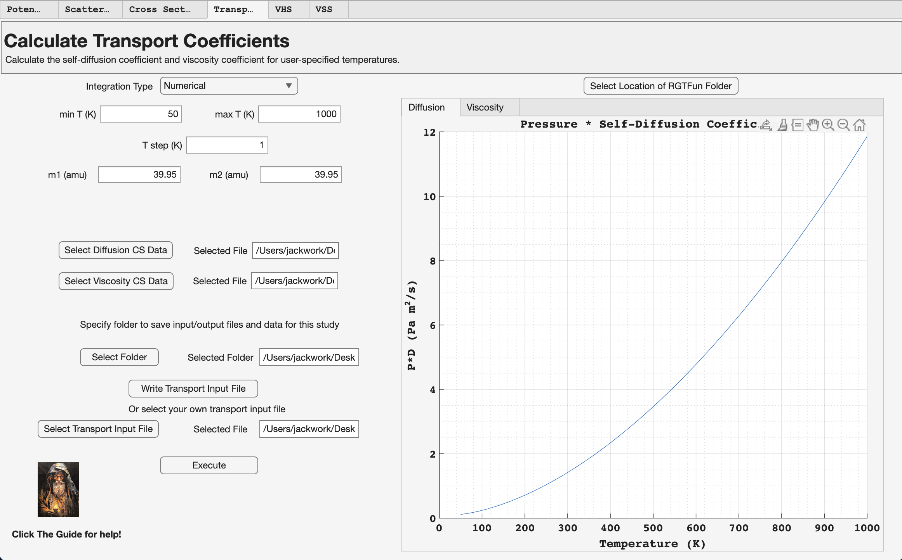
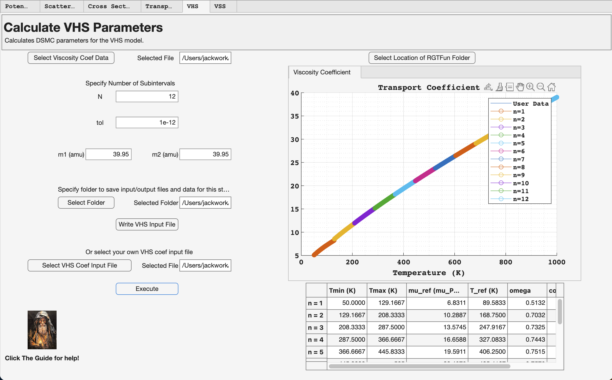
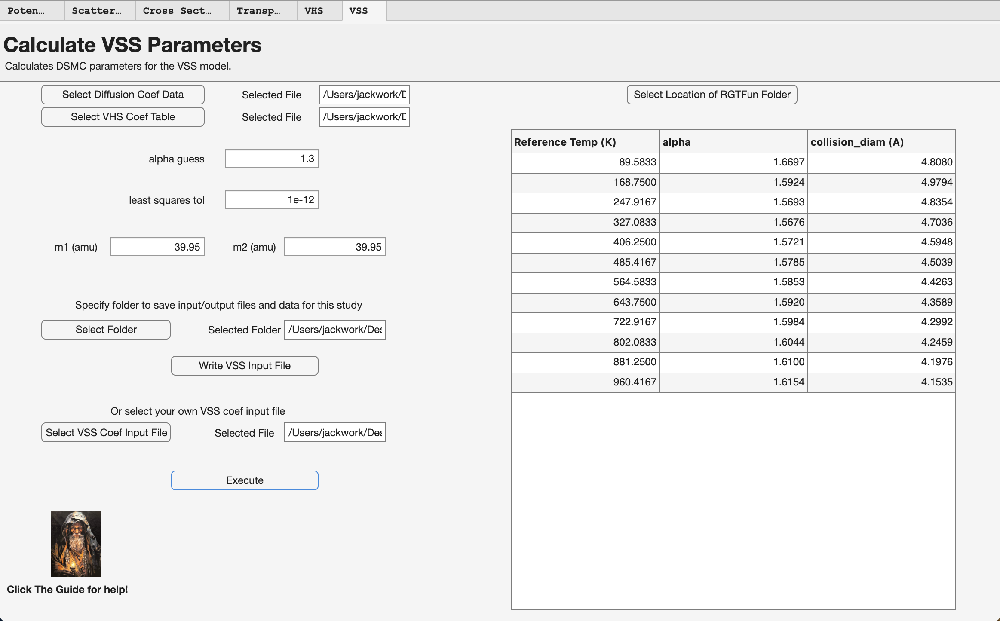

# Introduction
In this documentation we will provide instructions on how to access RGTFun, an example calculation using RGTFun that can be used as a tutorial for new users, and then discuss the included testing suite. Documentation for all functions can be found in the appendix.

# Downloading RGTFun
 RGTFun can be downloaded from the public Github repository linked here:  
https://github.com/nbb2/rgtfun/tree/paper  
 Please download all folders from the repository and ensure that they are all located within a *RGTFun* folder on your machine (it does not have to be called *RGTFun*). This is important because the app will ask you to select the RGTFun folder on your machine so it can establish the path to the *src* and *gui* folders. It does not matter where your *RGTFun* folder is located as long as it is a local folder, i.e. not in a cloud service. Once downloading the repository folders, you can start the app by opening the *gui.mlapp* file in the *gui* folder. Note that RGTFun must be run with MATLAB R2023b or newer. RGTFun is also available as a standalone desktop app and can be downloaded from the Releases page in the Github repository. Note that the standalone deskop app requires MATLAB Runtime R2024a to be installed, which is free to download from MathWorks (install instructions are located on the Release page in the RGTFun repository).

# Downloading Chebfun
Chebfun must be downloaded locally in order to run RGTFun. Chebfun can be downloaded from the Chebfun website linked here: 
https://www.chebfun.org/download/
Note that RGTFun requires Chebfun V5.7.0 or newer. Please download the Chebfun .zip file and unzip on your machine. We recommend putting Chebfun in an easy-to-find location since RGTFun will ask you to provide the path to the Chebfun directory.

# An Example Calculation of Argon-Argon Interaction
We will now present example calculations of transport quanitities and scattering integrals using RGTFun. The calculations will be performed for an Argon-Argon ZBL potential.
### Timing (end-to-end tutorial)

On a typical laptop, this end-to-end tutorial takes **~5–10 minutes** to complete (including generating inputs, running each tab, and saving plots/files).

**Timing reference:** Apple Silicon laptop (macOS), MATLAB R2025b.

**What affects runtime most**
- The numerical grids used in the scattering and cross-section steps:
  - runtime increases roughly with **(# energy points) × (# impact parameter points)** in the scattering-integrals step.
- The number of temperature points used in the transport-coefficient step.

**Speed-up for quick iteration**
- If you want a faster “sanity check” run, reduce the grid sizes (e.g., fewer energy points or fewer impact-parameter points) and then increase them for final-quality results.

## Calculate/Fit Potential Tab
{ width=80% }

The *Calculate/Fit Potential* tab allows you to either create your own potential data or fit one of the RGTFun-supported potentials to your own data.
### Inputs used in this tutorial
| Setting / Parameter | Value | Notes |
|---|---:|---|
| Selected Action | Calculate Potential | Creates user-specified potential data |
| Fit/Potential Type | ZBL | Universal screened potential |
| min r (Å) | 0.1 | Minimum interatomic distance |
| max r (Å) | 10 | Maximum interatomic distance |
| r step (Å) | 0.1 | Distance grid spacing |
| Z1 | 18 | Argon atomic number |
| Z2 | 18 | Argon atomic number |
### Steps
1. Open the **Calculate/Fit Potential** tab.
2. In **Selected Action**, choose **Calculate Potential**.
3. In **Fit/Potential Type**, choose **ZBL**.
4. Enter the values in the table above: **min r**, **max r**, **r step**, **Z1**, and **Z2**.
5. Under *Specify folder to save input/output files and data for this study*, click **Select Folder** and choose an output directory.
6. Click **Write Input File** to generate an input file with the parameters above.  
   - This will automatically populate the *Or Select Your Own Input File* field.
7. Click **Execute** to:
   - generate the potential data,
   - plot the potential,
   - save the plot image, and
   - write the output data and fit file to the selected directory.
### Expected output
The resulting plot should match the linear plot in the figure above.
### Notes
- Distances are specified in **Å**.
- For other species, set **Z1** and **Z2** to the corresponding atomic numbers.

## Calculate Scattering Integrals Tab
{ width=80% }

The *Calculate Scattering Integrals* tab allows you to calculate the distance of closest approach (DOCA) and scattering angle as a function of impact parameter. 
### Inputs used in this tutorial
| Setting / Parameter | Value | Notes |
|---|---:|---|
| Integral Type | Numerical | Uses potential data generated in the previous tab |
| min E | 0.01 | Energy range lower bound |
| max E | 10 | Energy range upper bound |
| Energy spacing | Log | Check **Log spacing** |
| number of pts (E) | 50 | Number of energies evaluated |
| Fit output file | *(auto-populated)* | Populated after clicking **Execute** in the previous tab |
| b min | 0.0001 | Impact parameter range lower bound |
| b max | 10 | Impact parameter range upper bound |
| b spacing | Log | Use log spacing |
| number of pts (b) | 200 | Number of impact parameters evaluated |
| min Rmin | 0.1 | Root-solver bracket for DOCA |
| max Rmin | 100 | Root-solver bracket for DOCA |

### Steps
1. Open the **Calculate Scattering Integrals** tab.
2. Set **Integral Type** to **Numerical** (to use the potential data generated in the previous tab).
3. Under the energy settings, enter:
   - **min E = 0.01**
   - **max E = 10**
   - check **Log spacing**
   - set **number of pts = 6**
4. Confirm that the **fit output file** field is populated (this should happen automatically after running **Execute** in the previous tab). If it is not populated, select the fit output file manually.
5. Under the impact parameter settings, enter:
   - **b min = 0.0001**
   - **b max = 10**
   - select **log spacing**
   - set **number of points = 200**
6. Under the DOCA root-solver settings, set:
   - **min Rmin = 0.1**
   - **max Rmin = 100**
7. Click **Write Scattering Input File** to generate the input file for this tab.
8. Click **Execute** to:
   - compute DOCA and scattering angle datasets,
   - save the datasets to the selected study/output folder, and
   - save the generated figures as image files.

### Expected output
After clicking **Execute**, you should see plots for the DOCA and scattering angle. The DOCA plot should have a similar overall shape to the figure above. Note that the figure above was generated using **6 energy points** to make individual curves easier to distinguish; for this tutorial we recommend using **50 energy points** to obtain a smoother, better-resolved energy dependence. The tab will also write the DOCA and scattering-angle data files into your study folder.

### Notes
- If the DOCA solver fails or produces nonphysical values, adjust **min Rmin** and **max Rmin** to better bracket the turning point for your potential and energy range.

## Calculate Cross Sections Tab
{ width=80% }

The *Calculate Cross Sections* tab allows you to calculate total cross section, diffusion cross section, viscosity cross section, and stopping cross section. 
### Inputs used in this tutorial

| Setting / Parameter | Value | Notes |
|---|---:|---|
| Integral Type | Numerical | Uses scattering angle vs. impact parameter from the previous tab |
| Energy grid (min E, max E, number of pts, spacing) | *(auto-populated)* | Must match the scattering integrals tab parameters |
| m1 (amu) | 39.95 | Argon atomic mass |
| m2 (amu) | 39.95 | Argon atomic mass |
| Scattering-angle data file | *(auto-populated)* | Populated after running the previous tab |
| Total cross section cutoff | Quantum mechanical cutoff | Used for the total cross section |

### Steps
1. Open the **Calculate Cross Sections** tab.
2. Set **Integral Type** to **Numerical** to use the scattering-angle data from the previous tab.
3. Confirm the energy grid fields are auto-populated (min E, max E, number of points, and spacing).
   - **Do not change these values** for this tutorial. They must match the energy grid used to generate the scattering angle data.
4. Confirm the **scattering angle data file path** is populated. If it is not, select the file manually.
5. Enter the species masses:
   - **m1 = 39.95 amu**
   - **m2 = 39.95 amu**
6. For the **total cross section**, select the **quantum mechanical cutoff** option.
7. Click **Write CS Input File** to generate the cross-section input file.
8. Click **Execute** to:
   - compute the requested cross sections,
   - save the outputs as CSV files in your study/output folder, and
   - save the generated figures as image files.

### Expected output
After clicking **Execute**, RGTFun will generate plots and CSV files for the selected cross sections (total, diffusion, viscosity, and/or stopping) as functions of center-of-mass energy. The diffusion cross section is the quantity shown in the figure above and should match your result.

### Notes
- The **energy grid must match** the scattering angle dataset used as input. If you change the energy grid here without regenerating the scattering angle data, the results will be inconsistent and the code will fail.
- If you change the masses (m1/m2) to another species pair, ensure they are in **atomic mass units (amu)**.

## Calculate Transport Coefficients Tab
{ width=80% }

The \textit{Calculate Transport Coefficients} tab allows you to calculate the self-diffusion coefficient and viscosity coefficient for user-specified temperatures. 

### Inputs used in this tutorial

| Setting / Parameter | Value | Notes |
|---|---:|---|
| Integration Type | Numerical | Uses cross section data from the previous tab |
| min T (K) | 50 | Lower temperature bound |
| max T (K) | 1000 | Upper temperature bound |
| T step (K) | 1 | Temperature increment |
| Species masses | *(auto-populated)* | Populated from the previous tab |
| Cross section file paths | *(auto-populated)* | Populated from the previous tab |

### Steps
1. Open the **Calculate Transport Coefficients** tab.
2. Set **Integration Type** to **Numerical** to use cross section data generated in the previous tab.
3. Enter the temperature grid (Kelvin):
   - **min T = 50**
   - **max T = 1000**
   - **T step = 1**
4. Confirm that the **species masses** and **cross section file paths** are populated (these should auto-populate from the previous tab). If they are not populated, return to the Cross Sections tab and re-run **Execute**, or select the files manually.
5. Click **Write Transport Input File** to write the input file into your study/output folder.
6. Click **Execute** to:
   - compute self-diffusion and viscosity coefficients over the temperature grid,
   - save the results as CSV files in your study/output folder, and
   - generate and save the corresponding plots as image files.

### Expected output
After clicking **Execute**, RGTFun will produce temperature-dependent plots for the self-diffusion and viscosity coefficients and write the corresponding CSV output files to the study folder. The plot for the self-diffusion coefficient is shown in the figure above and should match your result.

### Notes
- Temperatures are specified in **Kelvin**.

## Calculate VHS Parameters Tab
{ width=80% }

 The *Calculate VHS Parameters* tab allows the user to calculate the $\omega$ parameter for the VHS DSMC model. This parameter is calculated by fitting the VHS diffusion coefficient expression to the user-provided viscosity coefficient data. 

### Inputs used in this tutorial

| Setting / Parameter | Value | Notes |
|---|---:|---|
| Viscosity coefficient file | *(auto-populated)* | Populated after executing the Transport Coefficients tab |
| N (subintervals) | 12 | Viscosity data are split into *N* subintervals; a fit is performed per subinterval |
| Fit tolerance (tol) | 1e-12 | Suggested: 1e-12 or smaller |
| Species masses | *(auto-populated)* | Populated from previous tab |

### Steps
1. Open the **Calculate VHS Parameters** tab.
2. Confirm that the **viscosity coefficient data file** path is populated (this should auto-populate after running the previous tab). If it is not populated, select the viscosity CSV file manually.
3. Set the number of fitting subintervals:
   - **N = 12**
4. Set the fitting tolerance:
   - **tol = 1e-12**
5. Confirm that the **species masses** are populated (they should carry over from the previous tab).
6. Click **Write VHS Input File** to write the input file into your study/output folder.
7. Click **Execute** to:
   - fit $\omega$ over each subinterval of the viscosity data,
   - compute a collision diameter for each subinterval,
   - plot the viscosity data and fitted subintervals, and
   - populate the tab’s results table.

### Expected output
After clicking **Execute**, the tab will display a plot showing the input viscosity data and the fitted subintervals, and the results table will list $\omega$ and collision diameter values for each subinterval. The results table is also saved to the study/output folder. The figure above shows a plot of the fitted viscosity coefficient data and the fitted $\omega$ values.

### Notes
- Increasing **N** increases the resolution of the fit (more subintervals), but may amplify noise in the fitted parameters if the viscosity data are not smooth.
- If the fit fails to converge, try relaxing the tolerance slightly (e.g., 1e-10) or reducing **N**.

## Calculate VSS Parameters Tab
{ width=80% }

 The *Calculate VSS Parameters* tab computes Variable Soft Sphere (VSS) DSMC parameters from previously generated transport data. Using (i) the reference viscosity and diffusion coefficients and (ii) the VHS fit results (reference $\omega$ values), this tab solves for the VSS parameters **$\alpha$** and the **collision diameter** as functions of the reference temperature.

Given an initial guess for $\alpha$, RGTFun iterates between:
- computing the collision diameter from the viscosity data and current $\alpha$ and $\omega$, and
- updating $\alpha$ from the diffusion data and the updated collision diameter,

until the user-specified least-squares tolerance is satisfied (or a maximum iteration count is reached). The outputs are saved to the study folder and include the reference temperature, fitted $\alpha$, and collision diameter.

### Inputs used in this tutorial

| Setting / Parameter | Value | Notes |
|---|---:|---|
| Diffusion coefficient file | *(auto-populated)* | From the **Transport Coefficients** tab |
| VHS coefficient table | *(auto-populated)* | From the **VHS Parameters** tab |
| alpha guess | 1.3 | Recommended range: 1–2 |
| least squares tol | 1e-12 | Suggested: 1e-12 or smaller |
| Species masses | *(auto-populated)* | Carried over from previous tabs |

### Steps
1. Open the **Calculate VSS Parameters** tab.
2. Confirm that the **diffusion coefficient data file** path and **VHS coefficient table** path are populated.  
   - If not, select the diffusion CSV (from the Transport tab) and the VHS table CSV (from the VHS tab) manually.
3. Enter an initial guess for $\alpha$ (recommended range 1–2):
   - **alpha guess = 1.3**
4. Set the least squares tolerance:
   - **tol = 1e-12**
5. Confirm that the **species masses** are populated.
6. Click **Write VSS Input File** to write the input file into your study/output folder.
7. Click **Execute** to:
   - compute $\alpha$ and collision diameter values at each reference temperature, and
   - populate the tab’s results table.

### Expected output
After clicking **Execute**, the results table will list $\alpha$ and collision diameter values for each reference temperature. The table is also written to the study folder as `VSScoeftable.csv`. The figure above shows the calculated $\alpha$ and collision diameter values.

### Notes
- If the iteration fails to converge, try adjusting **alpha guess** (e.g., 1.1–1.8) and/or relaxing **tol** (e.g., 1e-10).
- The VSS fit assumes the diffusion and viscosity data correspond to the same species pair and reference temperatures used in the earlier tabs.

# RGTFun Test Suite
A test suite has been included in the main RGTFun distribution so that users can verify their version is functioning correctly. Test functions were written to verify the functionality of all main functions within RGTFun. The test functions are located in the *test* folder within the main *RGTFun* folder. All test reference data is located in the *testFiles* folder. To run the tests, please change directories to the *test* folder and load the test functions in the MATLAB Test Browser. Then run the current suite, and verify that all tests were executed successfully. 

# Community Guidelines
Please put all requests for code changes in the Github issue tracker at:
https://github.com/nbb2/rgtfun/issues