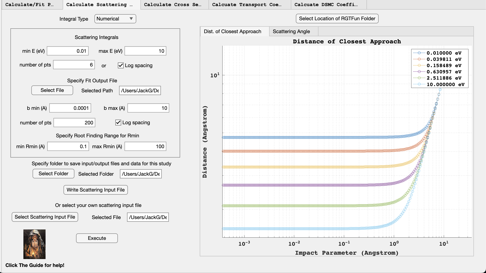
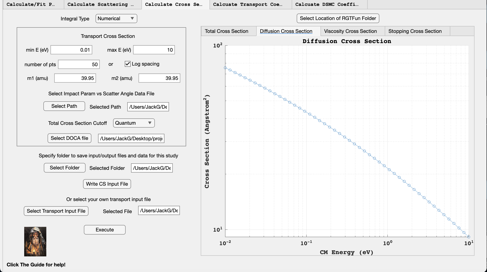
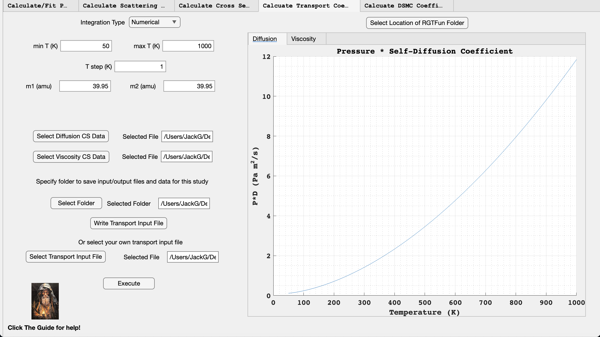
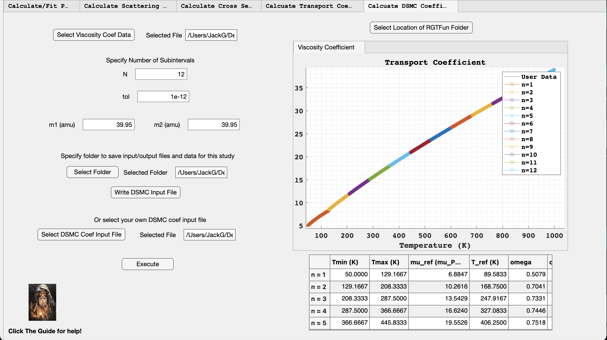

# Introduction
In this documentation we will provide instructions on how to access RGTFun, an example calculation using RGTFun that can be used as a tutorial for new users, and then discuss the included testing suite. Documentation for all functions can be found in the appendix.

# Accessing RGTFun
 RGTFun can be downloaded from the public Github repository linked here:  
https://github.com/nbb2/rgtfun/tree/paper  
 Please download all folders from the repository and ensure that they are all located within a *RGTFun* folder on your machine (it does not have to be called *RGTFun*). This is important because the app will ask you to select the RGTFun folder on your machine so it can establish the path to the *src* and *gui* folders. It does not matter where your *RGTFun* folder is located as long as it is a local folder, i.e. not in a cloud service. Once downloading the repository folders, you can start the app by opening the *gui.mlapp* file in the *gui* folder. 

# An Example Calculation of Argon-Argon Interaction
We will now present example calculations of transport quanitities and scattering integrals using RGTFun. The calculations will be performed for an Argon-Argon ZBL potential.

## Calculate/Fit Potential Tab
{ width=80% }

The *Calculate/Fit Potential* tab allows you to either create your own potential data or fit one of the RGTFun-supported potentials to your own data. For this example, we wanted to calculate a ZBL potential for an Argon-Argon interaction. To begin, we selected "Calculate Potential" from the "Selected Action" drop-down menu. Then, we selected "ZBL" from the "Fit/Potential Type" drop-down menu. We then specified the distance values and potential parameters. Then we selected the folder where RGTFun will save the input/output files and data. We then clicked "Write Input File" to generate an input file with the potential parameters specified. This will auto populate the "Or Select Your Own Input File" box. Lastly, we selected "Execute" to generate potential data, plot the potential data, save the plot as an image, and save a fit output file for the data. 

## Calculate Scattering Integrals Tab
{ width=80% }

The *Calculate Scattering Integrals* tab allows you to calculate the distance of closest approach (DOCA) and scattering angle as a function of impact parameter. First, we chose "Numerical" from the "Integral Type" drop down menu becuase we wanted to use our potential data from the previous tab. We then specified the energy range for calculating the quantities. Since we wanted log spacing for the energy values, we clicked the "Log spacing" box and specifed the number of points. Note that our fit output file was autopopulated after we clicked "Execute" in the previous tab. We then specified the impact parameter range to integrate over and chose to use log spacing for these values. We then specified a range for the root solver used in the DOCA calculations. We then clicked "Write Scattering Input File" to write the input file and clicked "Execute" to generate datasets for the DOCA and scattering angle, save those data sets to our "study" folder, and save the figures as images.

## Calculate Cross Sections Tab
{ width=80% }

The *Calculate Cross Sections* tab allows you to calculate total cross section, diffusion cross section, viscosity cross section, and stopping cross section. First, we selected "Numerical" from the "Integral Type" drop-down, which will use the scattering angle vs. impact parameter data from the previous tab. While the energy values from the previous tab autopopulate into this tab, we have increased the number of energy points from what was used in figure 7 to reduce error in the trapezoidal integrals used in this tab. We then specified the atomic mass of Argon in atomic units. Note that the file path of the scattering angle data was autopopulated when the previous tab was executed. Then we chose to use a quantum mechanical cutoff for the total cross section. Then, we clicked "Write CS Input File" to create the input file for the cross section calculations. Lastly, we clicked "Execute" to calculate the cross sections, save the data as csv files in our "study folder", and save the figures as images.

## Calculate Transport Coefficients Tab
{ width=80% }

The \textit{Calculate Transport Coefficients} tab allows you to calculate the self-diffusion coefficient and viscosity coefficient for user-specified temperatures. First, we selected "Numerical" from the "Integration Type" drop down, which allows us to use the cross section data from the previous tab.  Next, we specified the temperature range (in Kelvin) that the code should use to calculate the transport coefficient data. Note that the atomic masses of the present species, as well as the locations of the cross section data files, were autopopulated from the previous tab. We then clicked "Write Transport Input File" to write the input file to our "study" folder. Lastly, we clicked "Execute" to calculate the self-diffusion and viscosity coefficient data, save the data as csv files in our "study" folder, plot the data, and save the plots as images.

## Calculate DSMC Coefficients Tab
{ width=80% }

 The *Calculate DSMC Coefficients* tab allows the user to calculate the $\omega$ parameter for the VHS DSMC model. This parameter is calculated by fitting the VHS diffusion coefficient expression to the user-provided viscosity coefficient data. Note that the location of our viscosity coefficient data file was autopopulated upon execution of the previous tab. Next, we specifed the number of subintervals to split the data into for fitting. An $\omega$ parameter will be calculated for each subinterval. We also specifed the tolerance for the fitting. A tolerance of 1e-12 or lower is suggested. Note that the atomic masses of the present species were autopopulated from the previous tab. We then clicked "Write DSMC Input File" to write the input file to our "study folder". Lastly, we clicked "Execute" to calculate an $\omega$ parameter for each subinterval of our viscosity coefficient data, as well as a collision diameter for each subinterval. Our viscosity coefficient data from the previous tab and the fitted subintervals are plotted. All relevant quantities are visible in the tab’s table. This table is saved to our "study" folder.

# RGTFun Test Suite
A test suite has been included in the main RGTFun distribution so that users can verify their version is functioning correctly. Test functions were written to verify the functionality of all main functions within RGTFun. The test functions are located in the *test* folder within the main *RGTFun* folder. All test reference data is located in the *testFiles* folder. To run the tests, please change directories to the *test* folder and load the test functions in the MATLAB Test Browser. Then run the current suite, and verify that all tests were executed successfully. 
