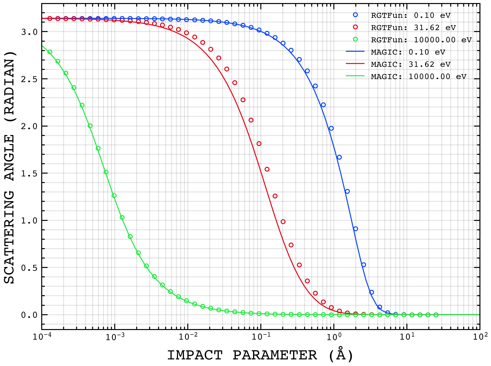
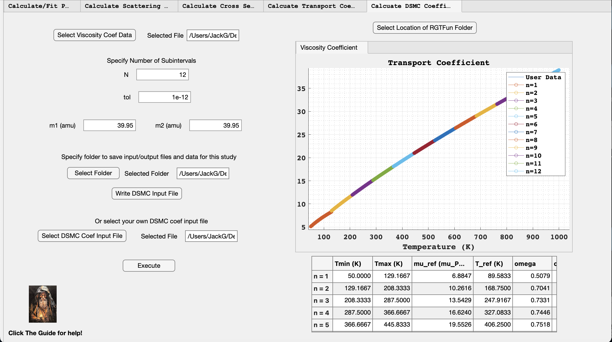

# Key Definitions
$b$ - impact parameter (Å)  
$\theta_c$ - center of mass scattering angle (radians)  
$r_o$  - distance of closest approach during a binary elastic collision (Å)  
$r_m$  - location of the energy minimum of the intermolecular potential (Å)  
$\epsilon$ - the depth of the attractive portion of the intermolecular potential (eV)  
$D_{12}$ - the binary diffusion coefficient ($m^2\cdot s$)  
$\mu$ - viscosity coefficient ($Pa \cdot s$)  
$E_c$ - center of mass energy during a collision (eV)  
$E_l$ - lab frame energy (eV)  
$\sigma(\theta_c)$ - the differential scattering cross section  
$\sigma_T$ - total cross section ($m^2$)  
$\sigma_D$ - the diffusion cross section, also called the momentum cross section ($m^2$)  
$\sigma_\mu$ - the viscosity cross section ($m^2$)  
$r$ - distance between the centers of two molecules (Å)  
$U(r)$ - the intermolecular potential energy function of two molecules (eV)  
$S$ - the stopping cross section ($eV\cdot m^2 \cdot molecule^{-1}$)  
$\chi$ - $(\pi - \theta_c)/2$  
$Z_1$ - number of protons of the first colliding molecule  
$Z_2$ - number of protons of the second colliding molecule  
$q$ - elementary charge ($C$)  
$d_{ref}$ - the reference diameter of the collision model used in the variable hard sphere model incorporated into the direct simulation Monte-Carlo method (Å)  
$\omega$ - the DSMC viscosity temperature dependence parameter  
$N_a$ - Avogadro's number (atoms / mol)  
$P_{vap}$ - equilibrium vapor pressure (Pa)  
$k_B$ - Boltzmann's constant ($J \cdot K^{-1}$)  
$T$ - temperature (K)  
$M_{Sn}$ - mass of a tin atom (Kg)  
$d_{12}$ - collision diameter used in the VHS collision rule for DSMC simulations  
$VHS$ - variablele hard sphere - the collision rule used for the DSMC

# Introduction
RGTFun is a MATLAB app designed for the efficient calculation of scattering integrals and transport coefficients of elastic collisions. While the solution for classical scattering, as well as its application for determining gas transport coefficients, has been known for over approximately a century [@chapman_mathematical_1990], the numerical codes are usually kept as closed source codes or are printed in textbooks in older programming languages such as FORTRAN [@maitland_intermolecular_1987].

This new code is open source and uses the well known dynamically compiled language MATLAB. Furthermore, the code features a well designed graphical user interface (GUI) to facilitate the step by step process of going from an intermolecular potential to macroscopic transport coefficients such as viscosity and diffusion coefficient. The ethos of the project is to decrease the learning curve of going from quantum chemistry calculations of intermolecular potential energy surfaces to usable transport coefficients in CFD or PIC codes.   

The paper briefly reviews the theory behind bimolecular scattering and how cross sections of elastic scattering events are used to calculate macroscopic transport properties. Then, four validation cases of the code are reviewed. Finally, an example calculation from start to finish is demonstrated. 

# Theory
## The Intermolecular Potential

The intermolecular potential describes the potential energy between two atoms or molecules and is a function of their distance $r$. The actual shape of the potential energy surface of two molecules is unique to the pair and detemrined using quantum chemistry software [@valiev_nwchem_2010] or experiments [@amdur_experimental_1961;@amdur_repulsive_1949; @amdur_scattering_1954;@ruzic_total_1984]. RGTFun currently supports the following intermolecular potential models:
	
- Coulomb Potential  

$$U(r) = \frac{Z_1 Z_2 e^2}{ 4 \pi \epsilon_0 r}$$  

- 12-6 Lennard-Jones Potential [@lennard1931cohesion]  

$$U(r) = 4 \epsilon \left[\left(\frac{\sigma}{r}\right)^{12} - \left(\frac{\sigma}{r}\right)^6\right]$$
where $$\sigma  = 2^{-1/6} r_{m} $$  

- 12-4 Lennard-Jones Potential [@zhen1983calculation]  

$$U(r) = \frac{3^{3/2}}{2} \epsilon \left[\left(\frac{\sigma}{r}\right)^{12} - \left(\frac{\sigma}{r}\right)^4\right]$$
where $$\sigma  = 3^{-1/8} r_{m} $$  

- ZBL Potential [@Ziegler19831861]  

$$U(r) = \frac{1}{4 \pi \epsilon_0} \frac{Z_2 Z_2 e^2}{r} \phi(r/a)$$
where 
$$a = \frac{0.46850}{Z_1 ^{0.23} + Z_2 ^{0.23}}$$
and 
$$\phi(x) = 0.18175 e^{-3.19980 x} + 0.50986 e^{-0.94229 x} + 0.28022 e^{-0.40290 x} + 0.02817 e^{-0.20162 x}$$  

- Morse Potential [@morse1929diatomic]  

$$U(r) = \epsilon \left( e^{-2 a (r-r_m)} -2 e^{- a (r-r_m)}\right)$$ 
where $$a  = \sqrt{\frac{k}{2 \epsilon}}$$  

- Power Law Potential  

$$U(r) = a r^{-k}$$ 
	
## Bimolecular Scattering
Once an intermolecular potential is known, the scattering angle can be determined as a function of impact energy and impact parameter. First, the distance of closest approach $r_o$ must be solved by finding the root of equation (1) where $E_c$ is the center of mass energy. Next, the scattering angle $\theta_c$ is solved by integrating equation (2).

$$ 1 - \frac{V(r_o)}{E_c} - \frac{b^2}{r_o^2} = 0 \quad (1) $$

$$\theta_c = \pi - 2 \int_{r_o}^{\infty} \frac{bdr}{r^2 \sqrt{1 - \frac{V(r)}{E_c} - \frac{b^2}{r^2}}} \quad (2)$$

## Cross Sections
With a relationship between the impact parameter and scattering angle, cross section quantities can be defined. The differential cross section is defined by equation (3). The total cross section is defined by equation (4). It is important to note that the classical cross section is infinite. If a quantum mechanical approach is taken, then the total cross section becomes finite again. Instead of doing a quantum mechanical calculation, we can instead define a cutoff angle, $\theta_{cutoff}$, which has a corresponding cutoff impact parameter which makes a finite cross section according to equation (5). The cutoff angle can be chosen to either be the smallest measurable angle or when the classical scattering is no longer valid. The condition for the cutoff angle becoming invalid is given by equation (6) [@lane_calculations_1960]. Solving equation (6) requires a numerical root finding procedure. The momentum cross section is given by equation (7) and the viscosity cross section is given by equation (8). These last two cross sections are needed to calculate continuum transport coefficients using Chapman-Enskog theory. The final cross section of importance is the stopping cross section, given by equation (9), which tells us how much energy is lost per unit travel per unit density.
	
$$\sigma(\theta_c,E) = \left|\frac{b}{sin(\theta_c)} \frac{db}{d\theta}\right| \quad (3) $$

$$\sigma_T(E) = \int_{0}^{\pi} \sigma(\theta_c,E) 2\pi \sin(\theta_c) d \theta_c = 2\pi \int_{0}^{\infty}bdb  = \infty \quad (4)$$  
  
$$\sigma_T(E)_{classical} = \int_{0}^{\pi} \sigma(\theta_c,E) 2\pi \sin(\theta_c) d \theta_c$$

$$\sigma_T(E)_{classical} = \int_{\theta_{cutoff}}^{\pi} \sigma(\theta_c,E) 2\pi \sin(\theta_c) d \theta_c =  \int_{0}^{b_{cutoff}}bdb = 2 \pi b_{cutoff}^2 \quad (5) $$

$$\theta_c(b_{cutoff}) - \frac{\hbar}{2\sqrt{2 E_c / m_r}\cdot  r_o(b_{cutoff},E_c)} = 0 \quad (6)$$

$$\sigma_D(E) = \int_{0}^{\pi} (1 - \cos(\theta_c))\cdot \sigma(\theta_c,E) 2\pi \sin(\theta_c) d \theta_c = 2\pi \int_{0}^{\infty}(1 - \cos(\theta_c))\cdot bdb \quad (7) $$

$$\sigma_{\mu}(E) = \int_{0}^{\pi} (1 - \cos^2(\theta_c))\cdot \sigma(\theta_c,E) 2\pi \sin(\theta_c) d \theta_c = 2\pi \int_{0}^{\infty}(1 - \cos^2(\theta_c))\cdot bdb \quad (8) $$

$$S_n = \frac{1}{n} \frac{dE}{dx}= \gamma E \sigma_D \quad (9) $$
where 
$$\gamma  = \frac{2 M_1 M_2}{(M_1 + M_2)^2}$$

## Continuum Transport Coefficients
The binary diffusion and single species viscosity [^1] coefficient can be determined by using the results of Chapman-Enskog theory [@chapman_mathematical_1990;@maitland_intermolecular_1987]. The binary diffusion coefficient is given by equation (10) and the single species viscosity is given by equation (11). In these two equations, $\sigma$ and $\sigma_{12}$ are characteristic lengths of the interatomic potential (when they cross zero) and the $\Omega$ functions are given by equations (12) and (13). The collision integrals are calculated using the results of the cross sections discussed in the previous section.
	
$$D_{12} = \frac{3}{16} \cdot \frac{1}{n} \cdot \left(\frac{2k_B T (m_1 + m_2)}{\pi m_1 m_2}\right)^{1/2} \frac{1}{\sigma_{12}^2 \Omega_{12}^{(1,1)^*}} \quad (10) $$

$$\mu = \frac{5}{16} \cdot \left(\frac{m k_B T}{\pi }\right)^{1/2} \frac{1}{\sigma^2 \Omega^{(2,2)^*}} \quad (11)$$

$$\Omega_{12}^{(1,1)^*} = \int_{0}^{\infty} \sigma_D E^2 e^{-\frac{E}{k_BT}}dE \quad (12) $$

$$\Omega^{(2,2)^*} =  \int_{0}^{\infty} \sigma_{\mu} E^3 e^{-\frac{E}{k_BT}}dE \quad (13) $$

[^1]: The mixture viscosity is a much more tortuous expression, see [@maitland_intermolecular_1987].

## DSMC Coefficients
The most common DSMC collision rule is called the variable hard sphere (VHS) model. In this model, the relative velocity of two colliding particles determines an effective hard sphere potential and the particles collide according to the classic hard sphere scattering rule [@bird_dsmc_2013]. This rule is given by equation (14) where $d_{12}$ is the average of the two particles' diameters and is a function of the relative velocity according to equation (15). The value of $\omega$ in equation (15) is determined by fitting viscosity data over a limited range of temperatures which passes through a reference viscosity, $\mu_{ref}$, at a chosen reference temperature, $T_{ref}$, according to equation (16). Note that equation (14), the hard shell scattering rule, is undefined at impact parameters larger than $d_{12}$ which defines its total cross section [@fratus_scattering_2015].
	
$$b  = d_{12} \cdot \cos (\theta_c / 2) \quad (14)$$

$$d_{12} = \left(\frac{15\cdot (mk_bT/\pi)}{2\cdot (5-2\omega)\cdot (7-2\omega )\mu}\right)^{1/2} \quad (15)$$

$$\mu = \mu_{ref} \cdot \left(\frac{T}{T_o}\right)^{\omega} \quad (16)$$

# Validation of RGTFun
Four main validation cases were used to verify the results obtained from RGTFun. These were: 

- Comparison of RGTFun scattering angle obtained from Coulomb potential vs exact scattering Coulomb scattering angle.
- Comparison of RGTFun scattering angle obtained from ZBL potential vs scattering angle from the Magic Formula [@biersack_monte_1980].
- Comparison of RGTFun Nuclear Stopping Cross Section obtained from ZBL potential [@ziegler_treatise_1985] to SRIM [@ziegler_srim_2010] nuclear stopping cross section for H into H.
- Comparison of RGTFun Viscosity Coefficient and Self-Diffusion Coefficient for Argon to NIST Argon data [@kestin_equilibrium_1984].

## Validation of Rutherford Scattering
As a first step in validation, we compared the scattering angle data obtained from RGTFun for a H-H Coulomb potential to the exact scattering angles for a Coulomb potential [@goldstein_classical_2008]. This validation case was chosen because the Coulomb potential is one of the few potentials for which there exists an exact solution for the scattering angle (the other being the series solution for the inverse power law potential). This comparison is shown in figure 1. In the figure, it is clear that the RGTFun scattering angle calcuation is in agreement with the analytical calcuation of Rutherford scattering.

|  |
|:--:|
| **Figure 1:** Comparison of scattering angle vs impact parameter curves for three different CM energies for a H-H Coulomb potential. The exact scattering angle curves are plotted as solid lines and the RGTFun scattering angle data are plotted as circles. |

## Validation Against Magic Formula Scattering
Next, we compared the scatteing angle data obtained from RGTFun for a H-H ZBL potential to the scattering angle data obtained from the Magic Formula [@biersack_monte_1980]. This comprison is shown in figure 2. In the figure, it is clear that the RGTFun scattering angle calcultations are in agreement with the Magic formula. However, RGTfun is slightly more accurate than the Magic Formula because it calcuate the full scattering integral. RGTfun can also handle a wider range of intermolecular potentials as well as help calculate transport properties. 

|  |
|:--:|
| **Figure 2:** Comparison of scattering angle vs impact parameter curves for three different CM energies for a H-H ZBL potential. The Magic Formula scattering angle curves are plotted as solid lines and the RGTFun scattering angle data are plotted as circles. RGTfun has the advantage of being slightly more accurate than the Magic algorithm as well as being able to handle a wider range of intermolecuar potential types. |

## Validation Against SRIM Nuclear Stopping Cross Section
Next, we compared the nuclear stopping cross section data obtained from RGTFun for a H-H ZBL potential to the nuclear stopping cross section data obtained from SRIM [@ziegler_srim_2010]. This comparison is shown in figure 3. In the figure, it is clear that the RGTFun nuclear stopping cross sections  are in excellent agreement with the SRIM nuclear stopping cross sections. 

|  |
|:--:|
| **Figure 3:** Comparison of RTGFun nuclear stopping cross section data to SRIM nuclear stopping cross section data for H into H. The SRIM data are plotted as solid lines and the RGTFun data are plotted as circles. |

## Validation Against NIST Transport Coefficient Data
Lastly, we compared the viscosity and self-diffusion coefficient data obtained from RGTFun for a 12-6 LJ potential of Ar to NIST transport coefficient data [@kestin_equilibrium_1984]. This comparison is shown in figures 4 and 5. From the figures we see excellent agreement between the RGTFun and NIST data for low temperatures, with the curves slightly diverting in both cases for high temperatures. This diversion is not an error in the calculation, but instead due to the limitation of the Lennard-Jones potential. This is deduced as the code calculated the same numerical result as the work of [@khrapak_accurate_2014].

|  |
|:--:|
| **Figure 4:** Comparison of RTGFun viscosity coefficient data to NIST viscosity coefficient data for Argon. The NIST data are plotted as a solid line and the RGTFun data are plotted as a dashed line. |

|  |
|:--:|
| **Figure 5:** Comparison of RTGFun self-diffusion coefficient data to NIST self-diffusion coeficient data for Argon. The NIST data are plotted as a solid line and the RGTFun data are plotted as a dashed line. |

# An Example Calculation of Argon-Argon Interaction
We will now present example calculations of transport quanitities and scattering integrals using RGTFun. The calculations will be performed for an Argon-Argon ZBL potential.

## Calculate/Fit Potential Tab
|  |
|:--:|
| **Figure 6:** Screenshot of *Calculate/Fit Potential* tab for an Argon-Argon ZBL potential. |

The *Calculate/Fit Potential* tab allows you to either create your own potential data or fit one of the RGTFun-supported potentials to your own data. For this example, we wanted to calculate a ZBL potential for an Argon-Argon interaction. To begin, we selected "Calculate Potential" from the "Selected Action" drop-down menu. Then, we selected "ZBL" from the "Fit/Potential Type" drop-down menu. We then specified the distance values and potential parameters. Then we selected the folder where RGTFun will save the input/output files and data. We then clicked "Write Input File" to generate an input file with the potential parameters specified. This will auto populate the "Or Select Your Own Input File" box. Lastly, we selected "Execute" to generate potential data, plot the potential data, save the plot as an image, and save a fit output file for the data. 

## Calculate Scattering Integrals Tab
|  |
|:--:|
| **Figure 7:** Screenshot of *Calculate Scattering Intergrals* tab for an Argon-Argon ZBL potential. |

The *Calculate Scattering Integrals* tab allows you to calculate the distance of closest approach (DOCA) and scattering angle as a function of impact parameter. First, we chose "Numerical" from the "Integral Type" drop down menu becuase we wanted to use our potential data from the previous tab. We then specified the energy range for calculating the quantities. Since we wanted log spacing for the energy values, we clicked the "Log spacing" box and specifed the number of points. Note that our fit output file was autopopulated after we clicked "Execute" in the previous tab. We then specified the impact parameter range to integrate over and chose to use log spacing for these values. We then specified a range for the root solver used in the DOCA calculations. We then clicked "Write Scattering Input File" to write the input file and clicked "Execute" to generate datasets for the DOCA and scattering angle, save those data sets to our "study" folder, and save the figures as images.

## Calculate Cross Sections Tab
|  |
|:--:|
| **Figure 8:** Screenshot of *Calculate Cross Sections* tab for an Argon-Argon ZBL potential. |

The *Calculate Cross Sections* tab allows you to calculate total cross section, diffusion cross section, viscosity cross section, and stopping cross section. First, we selected "Numerical" from the "Integral Type" drop-down, which will use the scattering angle vs. impact parameter data from the previous tab. While the energy values from the previous tab autopopulate into this tab, we have increased the number of energy points from what was used in figure 7 to reduce error in the trapezoidal integrals used in this tab. We then specified the atomic mass of Argon in atomic units. Note that the file path of the scattering angle data was autopopulated when the previous tab was executed. Then we chose to use a quantum mechanical cutoff for the total cross section. Then, we clicked "Write CS Input File" to create the input file for the cross section calculations. Lastly, we clicked "Execute" to calculate the cross sections, save the data as csv files in our "study folder", and save the figures as images.

## Calculate Transport Coefficients Tab
|  |
|:--:|
| **Figure 9:** Screenshot of *Calculate Transport Coefficients* tab for an Argon-Argon ZBL potential. |

The \textit{Calculate Transport Coefficients} tab allows you to calculate the self-diffusion coefficient and viscosity coefficient for user-specified temperatures. First, we selected "Numerical" from the "Integration Type" drop down, which allows us to use the cross section data from the previous tab.  Next, we specified the temperature range (in Kelvin) that the code should use to calculate the transport coefficient data. Note that the atomic masses of the present species, as well as the locations of the cross section data files, were autopopulated from the previous tab. We then clicked "Write Transport Input File" to write the input file to our "study" folder. Lastly, we clicked "Execute" to calculate the self-diffusion and viscosity coefficient data, save the data as csv files in our "study" folder, plot the data, and save the plots as images.

## Calculate DSMC Coefficients Tab
|  |
|:--:|
| **Figure 10:** Screenshot of *Calculate DSMC Coefficients* tab for an Argon-Argon ZBL potential. |

 The *Calculate DSMC Coefficients* tab allows the user to calculate the $\omega$ parameter for the VHS DSMC model. This parameter is calculated by fitting the VHS diffusion coefficient expression to the user-provided viscosity coefficient data. Note that the location of our viscosity coefficient data file was autopopulated upon execution of the previous tab. Next, we specifed the number of subintervals to split the data into for fitting. An $\omega$ parameter will be calculated for each subinterval. We also specifed the tolerance for the fitting. A tolerance of 1e-12 or lower is suggested. Note that the atomic masses of the present species were autopopulated from the previous tab. We then clicked "Write DSMC Input File" to write the input file to our "study folder". Lastly, we clicked "Execute" to calculate an $\omega$ parameter for each subinterval of our viscosity coefficient data, as well as a collision diameter for each subinterval. Our viscosity coefficient data from the previous tab and the fitted subintervals are plotted. All relevant quantities are visible in the tab’s table. This table is saved to our "study" folder.

 # Accessing RGTFun
 RGTFun can be downloaded from the public Github repository linked here:  
 INSERT LINK TO PUBLIC REPOSITORY HERE  
 Please download all folders from the repository and ensure that they are all located within a *RGTFun* folder on your machine (it does not have to be called *RGTFun*). This is important because the app will ask you to select the RGTFun folder on your machine so it can establish the path to the *src* and *gui* folders. It does not matter where your *RGTFun* folder is located as long as it is a local folder, i.e. not in a cloud service. Once downloading the repository folders, you can start the app by opening the *gui.mlapp* file in the *gui* folder. 
# References
